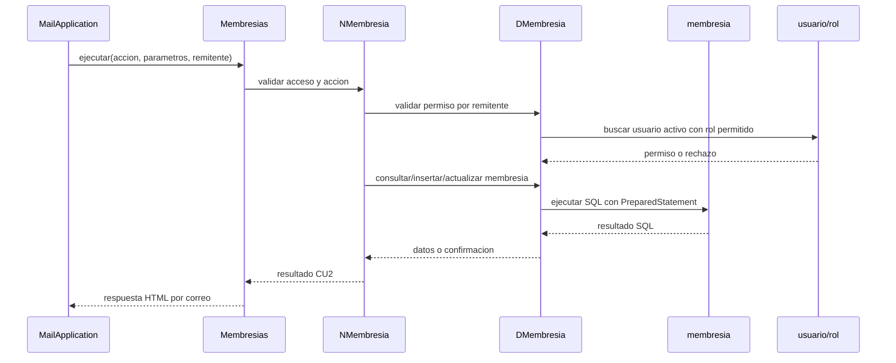

# CU2 Gestion de Membresias - Funcionamiento y Pasos

Este documento resume como funciona y como probar el caso de uso CU2 Gestion de Membresias en el proyecto de correo.

## 1. Objetivo del caso de uso

CU2 permite gestionar el catalogo de membresias del gimnasio mediante comandos enviados por correo.

La aplicacion:

- Lee correos entrantes por POP3.
- Interpreta el asunto del correo como comando.
- Valida el correo remitente contra la tabla `usuario`.
- Ejecuta la accion sobre la tabla `membresia`.
- Responde por SMTP al correo remitente.

## 2. Actores autorizados

Solo pueden usar CU2 los usuarios activos con rol:

- `Propietario`
- `Secretaria`

No pueden usar CU2:

- `Instructor`
- `Cliente`
- Usuarios con estado `INACTIVO`
- Correos no registrados en la tabla `usuario`

Respuesta esperada si no tiene permiso:

```text
Acceso denegado. Solo el Propietario o la Secretaria pueden gestionar membresías.
```

## 3. Preparar la base de datos

Ejecutar el script SQL del gimnasio en PostgreSQL:

```bash
psql "host=127.0.0.1 port=5432 user=grupo27sa dbname=db_grupo27sa" \
  -f sql/001_gimnasio_schema.sql
```

Tablas usadas por CU2:

- `membresia`
- `usuario`
- `rol`

Campos principales de `membresia`:

- `id_membresia`
- `nombre`
- `descripcion`
- `precio`
- `duracion_dias`
- `estado`

## 4. Verificar variables de entorno

Configurar `.env` con PostgreSQL y correo:

```env
PROYECTOEMAIL_DB_HOST=localhost
PROYECTOEMAIL_DB_PORT=5432
PROYECTOEMAIL_DB_NAME=db_grupo27sa
PROYECTOEMAIL_DB_USER=grupo27sa
PROYECTOEMAIL_DB_PASSWORD=tu_contrasena

PROYECTOEMAIL_POP3_HOST=localhost
PROYECTOEMAIL_POP3_PORT=110
PROYECTOEMAIL_POP3_USER=grupo27sa
PROYECTOEMAIL_POP3_PASSWORD=tu_contrasena

PROYECTOEMAIL_SMTP_HOST=localhost
PROYECTOEMAIL_SMTP_PORT=25
PROYECTOEMAIL_SMTP_FROM=grupo27sa@tecnoweb.org.bo
```

Nota: si `psql` falla usando `localhost` por autenticacion Ident, probar con `host=127.0.0.1`.

## 5. Crear usuario autorizado

Para probar CU2, el correo remitente debe existir en `usuario`, estar `ACTIVO` y tener rol `Propietario` o `Secretaria`.

Ejemplo para crear una Secretaria:

```sql
INSERT INTO usuario (id_rol, nombre, email, contrasena, estado)
SELECT id_rol, 'Secretaria Inicial', 'correo_secretaria@ejemplo.com', 'secretaria123', 'ACTIVO'
FROM rol
WHERE nombre_rol = 'Secretaria';
```

Importante: `correo_secretaria@ejemplo.com` debe reemplazarse por el correo real desde donde se enviaran los comandos.

## 6. Levantar la aplicacion

Modo normal, mostrando logs en consola:

```bash
./iniciar_proyecto.sh
```

Modo silencioso, dejando el proceso en segundo plano:

```bash
./iniciar_proyecto_silencioso.sh
```

Ver logs del modo silencioso:

```bash
tail -f logs/server.out.log
```

Detener la aplicacion:

```bash
./detener_proyecto.sh
```

## 7. Formato de comandos por correo

El comando se escribe en el asunto del correo.

Formato general:

```text
membresia accion [parametro1; parametro2; parametro3]
```

Los parametros se separan con punto y coma `;`.

## 8. Comandos disponibles

### Ayuda

Muestra los comandos disponibles de CU2.

```text
membresia ayuda
```

### Mostrar membresias

Lista todas las membresias registradas.

```text
membresia mostrar
```

### Agregar membresia

Crea una nueva membresia con estado `ACTIVO`.

```text
membresia agregar [nombre; descripcion; precio; duracion_dias]
```

Ejemplo:

```text
membresia agregar [Mensual; Acceso al gimnasio por 30 dias; 150; 30]
```

Reglas:

- `nombre` es obligatorio.
- `nombre` no debe repetirse.
- `precio` debe ser numerico y mayor o igual a 0.
- `duracion_dias` debe ser numerico y mayor a 0.

Respuesta esperada:

```text
Membresia registrada correctamente con ID <id>.
```

### Ver membresia

Muestra el detalle de una membresia por ID.

```text
membresia ver [id_membresia]
```

Ejemplo:

```text
membresia ver [1]
```

### Modificar membresia

Actualiza una membresia activa.

```text
membresia modificar [id_membresia; nombre; descripcion; precio; duracion_dias]
```

Ejemplo:

```text
membresia modificar [1; Mensual Plus; Acceso completo por 30 dias; 180; 30]
```

Reglas:

- Solo modifica membresias con estado `ACTIVO`.
- `id_membresia` debe ser numerico.
- `nombre` es obligatorio.
- `nombre` no debe repetirse en otra membresia.
- `precio` debe ser numerico y mayor o igual a 0.
- `duracion_dias` debe ser numerico y mayor a 0.

Respuesta esperada:

```text
Membresia modificada correctamente.
```

### Eliminar membresia

Realiza baja logica de una membresia activa.

```text
membresia eliminar [id_membresia]
```

Ejemplo:

```text
membresia eliminar [1]
```

Regla:

- No borra el registro fisicamente.
- Cambia `estado` a `INACTIVO`.

Respuesta esperada:

```text
Membresia marcada como INACTIVO correctamente.
```

### Renovar membresia

Reactiva una membresia inactiva del catalogo.

```text
membresia renovar [id_membresia]
```

Ejemplo:

```text
membresia renovar [1]
```

Reglas:

- Si la membresia esta `INACTIVO`, cambia `estado` a `ACTIVO`.
- Si la membresia ya esta `ACTIVO`, no modifica nada.
- No cambia `precio`, `descripcion` ni `duracion_dias`.
- No crea registros nuevos.
- No toca `suscripcion`.
- No toca `pagos`.

Respuestas esperadas:

```text
Membresia renovada correctamente.
```

```text
La membresía ya se encuentra activa.
```

## 9. Errores esperados

Parametros incompletos:

```text
Parametros invalidos. Uso: membresia agregar [nombre; descripcion; precio; duracion_dias]
```

Precio no numerico:

```text
precio debe ser numerico
```

Precio negativo:

```text
precio debe ser mayor o igual a 0
```

Duracion no numerica:

```text
duracion_dias debe ser numerico
```

Duracion menor o igual a 0:

```text
duracion_dias debe ser mayor a 0
```

Membresia no activa al modificar o eliminar:

```text
No existe membresia activa con id <id>
```

Comando no valido:

```text
Comando no valido para CU2. Use: membresia ayuda
```

## 10. Verificacion SQL

Listar membresias:

```sql
SELECT id_membresia, nombre, descripcion, precio, duracion_dias, estado
FROM membresia
ORDER BY id_membresia;
```

Verificar baja logica:

```sql
SELECT id_membresia, nombre, estado
FROM membresia
WHERE id_membresia = <id>;
```

Verificar permiso del remitente:

```sql
SELECT u.email, u.estado, r.nombre_rol
FROM usuario u
JOIN rol r ON r.id_rol = u.id_rol
WHERE lower(u.email) = lower('correo_remitente@ejemplo.com');
```

## 11. Flujo interno



## 12. Archivos relacionados

- `src/proyectoemail/MailAplication.java`: recibe y enruta el comando `membresia`.
- `src/Metodos/Membresias.java`: ejecuta acciones del CU2 y envia respuestas.
- `src/Negocio/NMembresia.java`: valida permisos, parametros y reglas de negocio.
- `src/Datos/DMembresia.java`: ejecuta consultas SQL sobre `membresia`, `usuario` y `rol`.
- `sql/001_gimnasio_schema.sql`: crea tablas base del gimnasio.

## 13. Checklist de pruebas

- [ ] `membresia ayuda` desde Propietario.
- [ ] `membresia ayuda` desde Secretaria.
- [ ] `membresia mostrar` desde Propietario.
- [ ] `membresia agregar [Mensual; Acceso por 30 dias; 150; 30]`.
- [ ] `membresia ver [id_membresia]`.
- [ ] `membresia modificar [id_membresia; Mensual Plus; Acceso completo; 180; 30]`.
- [ ] `membresia eliminar [id_membresia]`.
- [ ] Verificar en SQL que `estado = 'INACTIVO'`.
- [ ] `membresia renovar [id_membresia]`.
- [ ] Verificar en SQL que `estado = 'ACTIVO'`.
- [ ] `membresia mostrar` desde Instructor y validar acceso denegado.
- [ ] `membresia mostrar` desde Cliente y validar acceso denegado.
- [ ] `membresia mostrar` desde correo no registrado y validar acceso denegado.
