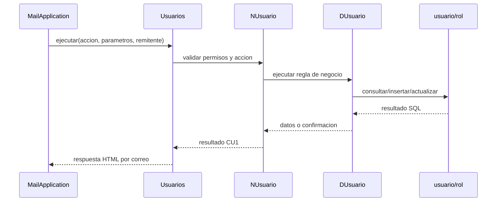
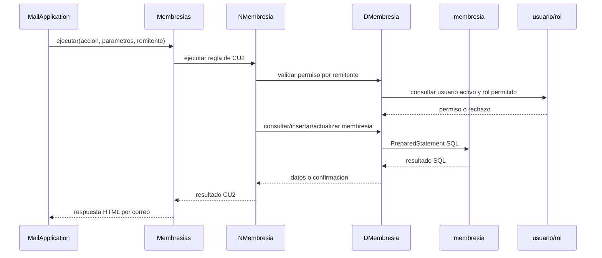

# ProyectoEmail Base

Proyecto Java base para procesar comandos recibidos por correo (POP3/SMTP + hilos + PostgreSQL), sin Spring Boot.

## Que es este proyecto

Es un backend que se ejecuta en segundo plano y procesa correos entrantes.

- Lee correos por POP3.
- Interpreta el asunto del correo como comando.
- Deja un punto central para conectar nuevos casos de uso.
- Responde por SMTP.
- Tiene conexion PostgreSQL configurable por variables de entorno.

No tiene interfaz grafica web ni desktop. Se opera por correo y por logs.

## Estado actual

Los casos de uso anteriores fueron retirados para dejar el proyecto listo para otro dominio.

Se elimino la logica de:

- Usuarios
- Casos hospitalarios
- Casos de brigada
- Mapas
- Enfermedades
- Estados
- Sintomas
- Tipos de punto
- Puntos de atencion
- Reportes

Se conserva la base tecnica:

- `src/proyectoemail/ProyectoEmail.java`: punto de entrada.
- `src/proyectoemail/MailAplication.java`: enrutador principal de comandos por correo.
- `src/Comunicacion/`: lectura POP3 y envio SMTP.
- `src/Conexion/DBConnection.java`: conexion PostgreSQL.
- `src/Utils/`: utilidades de correo, HTML, POP3 y manejo de errores.

Para agregar nuevos casos de uso, crea tus nuevas clases y conectalas desde `MailAplication`.

## Casos de uso del gimnasio

Documento analizado:

```text
/home/grupo27sa/Grupo004sc-sistema correo1.pdf
```

Casos de uso aprobados:

- CU1 Gestion de Usuarios: implementado.
- CU2 Gestion de Membresias: implementado.
- CU3 Gestion de Paquetes: pendiente.
- CU4 Gestion de Suscripcion: pendiente.
- CU5 Gestion de Rutinas: pendiente.
- CU6 Gestion de Seguimiento: pendiente.
- CU7 Gestion de Pagos: pendiente.
- CU8 Reportes y Estadisticas: pendiente.

Base de datos creada desde:

```text
sql/001_gimnasio_schema.sql
```

Tablas creadas:

- `rol`
- `usuario`
- `membresia`
- `suscripcion`
- `paquete`
- `venta_paquete`
- `rutina`
- `asignacion_rutina`
- `seguimiento`
- `pagos`
- `help`

Roles iniciales:

- `Propietario`
- `Secretaria`
- `Instructor`
- `Cliente`

### CU1 - Gestion de Usuarios

Actor autorizado: `Propietario`.

Roles aprobados:

- `Propietario`
- `Secretaria`
- `Instructor`
- `Cliente`

El sistema funciona por correo:

- Lee correos entrantes por POP3.
- El comando se escribe en el asunto del correo.
- Responde por SMTP al correo remitente.
- El correo remitente se usa para validar permisos.

Reglas de acceso:

- Solo el `Propietario` puede gestionar usuarios.
- Si el remitente no existe, esta inactivo o no es `Propietario`, el sistema responde:

```text
Acceso denegado. Solo el Propietario puede gestionar usuarios.
```

Reglas de eliminacion:

- La eliminacion es logica.
- El registro no se borra fisicamente.
- El campo `estado` cambia a `INACTIVO`.

Comandos validos de CU1:

```text
usuario ayuda
usuario mostrar
usuario agregar [nombre; email; contrasena; nombre_rol]
usuario ver [id_usuario]
usuario modificar [id_usuario; nombre; email; contrasena; nombre_rol]
usuario eliminar [id_usuario]
```

Ejemplo:

```text
usuario agregar [Juan Perez; juan@mail.com; secreto123; Cliente]
```

Ejemplo de comando invalido:

```text
usuario reporte
```

Archivos de CU1:

- `src/Datos/DUsuario.java`
- `src/Negocio/NUsuario.java`
- `src/Metodos/Usuarios.java`
- `src/proyectoemail/MailAplication.java`

Paquete documentado:

- `Usuarios`

Entidades del paquete:

- `Usuario`
- `Rol`

#### Diagrama de comunicacion CU1



#### Checklist de pruebas reales CU1

- [x] usuario ayuda desde Propietario
- [x] usuario mostrar desde Propietario
- [x] usuario agregar desde Propietario
- [x] usuario ver desde Propietario
- [x] usuario modificar desde Propietario
- [x] usuario eliminar desde Propietario
- [x] usuario reporte como comando invalido
- [x] usuario mostrar desde Secretaria
- [x] usuario mostrar desde correo no registrado
- [x] verificacion SQL de usuario ACTIVO
- [x] verificacion SQL de usuario INACTIVO despues de eliminar

Verificacion realizada:

- Compilacion con JDK 25: correcta.
- Prueba real contra PostgreSQL: se creo, consulto y elimino un usuario de prueba correctamente.

### CU2 - Gestion de Membresias

Actores autorizados:

- `Propietario`
- `Secretaria`

Actor indicador:

- `Secretaria`

Paquete documentado:

- `Servicios del Gimnasio`

Entidad principal:

- `Membresia`

El sistema funciona por correo:

- Lee correos entrantes por POP3.
- El comando se escribe en el asunto del correo.
- Responde por SMTP al correo remitente.
- El correo remitente se usa para validar permisos.

Reglas de acceso:

- Solo `Propietario` y `Secretaria` pueden gestionar membresias.
- `Instructor`, `Cliente`, usuarios `INACTIVO` y correos no registrados no pueden ejecutar CU2.
- Si el remitente no tiene permiso, el sistema responde:

```text
Acceso denegado. Solo el Propietario o la Secretaria pueden gestionar membresías.
```

Reglas de eliminacion:

- La eliminacion es logica.
- El registro no se borra fisicamente.
- El campo `estado` cambia a `INACTIVO`.

Reglas de renovacion:

- `membresia renovar [id_membresia]` reactiva una membresia del catalogo.
- Si existe y esta `INACTIVO`, cambia `estado` a `ACTIVO`.
- Si ya esta `ACTIVO`, responde:

```text
La membresía ya se encuentra activa.
```

- No modifica precio, descripcion ni duracion.
- No crea registros nuevos.
- No toca `suscripcion`.
- No toca `pagos`.

Comandos validos de CU2:

```text
membresia ayuda
membresia mostrar
membresia agregar [nombre; descripcion; precio; duracion_dias]
membresia ver [id_membresia]
membresia modificar [id_membresia; nombre; descripcion; precio; duracion_dias]
membresia eliminar [id_membresia]
membresia renovar [id_membresia]
```

Archivos de CU2:

- `src/Datos/DMembresia.java`
- `src/Negocio/NMembresia.java`
- `src/Metodos/Membresias.java`
- `src/proyectoemail/MailAplication.java`

Tabla relacionada:

- `membresia`

Campos usados:

- `id_membresia`
- `nombre`
- `descripcion`
- `precio`
- `duracion_dias`
- `estado`

#### Diagrama de comunicacion CU2



#### Checklist de pruebas reales CU2

- [x] membresia ayuda desde Propietario
- [x] membresia mostrar desde Propietario
- [x] membresia agregar desde Propietario
- [x] membresia ver desde Propietario
- [x] membresia modificar desde Propietario
- [x] membresia eliminar desde Propietario
- [x] membresia renovar desde Propietario
- [ ] membresia mostrar desde Secretaria
- [ ] membresia mostrar desde Instructor
- [ ] membresia mostrar desde Cliente
- [ ] membresia mostrar desde correo no registrado
- [ ] verificacion SQL de membresia ACTIVO
- [ ] verificacion SQL de membresia INACTIVO despues de eliminar
- [ ] verificacion SQL de membresia ACTIVO despues de renovar

## Agregar nuevos casos de uso

El punto de entrada para nuevos comandos esta en:

```text
src/proyectoemail/MailAplication.java
```

El metodo principal para conectar comandos nuevos es `handleCommand`.

Ejemplo:

```java
private void handleCommand(String command, List<String> params, Email email) {
    switch (command.toLowerCase()) {
        case "help":
        case "ayuda":
            send(email.getFrom(), HtmlBuilder.generateHelp());
            break;
        case "nuevo":
            // Llamar aqui a tu nuevo caso de uso.
            // Ejemplo: nuevoCaso.ejecutar(params, email.getFrom());
            break;
        default:
            sendError(
                    email.getFrom(),
                    "Comando no configurado",
                    "El comando '" + command + "' no tiene un caso de uso asociado todavia."
            );
            break;
    }
}
```

Formato basico esperado en el asunto del correo:

```text
comando [parametro1; parametro2; parametro3]
```

Ejemplo:

```text
nuevo [dato1; dato2]
```

## Requisitos

- JDK 25 (`javac 25.x` o compatible).
- PostgreSQL accesible en `localhost:5432`.
- Un servidor POP3/SMTP accesible.
- Libreria PostgreSQL JDBC en `lib/` para ejecutar conexiones reales a base de datos:
  - `postgresql-42.7.7.jar`

El proyecto base ya no depende de `Interpreter.jar`, `javax.mail.jar` ni `jbcrypt.jar`.

## Instalacion de Java en el servidor

El usuario `grupo27sa` no tiene permisos `sudo`, por eso Java se instalo de forma local en el home del usuario.

Ruta instalada:

```bash
/home/grupo27sa/.local/jdk25
```

Variables agregadas en `/home/grupo27sa/.bashrc`:

```bash
export JAVA_HOME="$HOME/.local/jdk25"
export PATH="$JAVA_HOME/bin:$PATH"
```

Verificacion realizada:

```bash
java -version
javac -version
```

Resultado esperado:

```text
openjdk version "25.0.3" 2026-04-21 LTS
javac 25.0.3
```

Si en una sesion actual no reconoce `java`, cargar nuevamente el `.bashrc`:

```bash
source ~/.bashrc
```

## Base de datos PostgreSQL en el servidor

PostgreSQL esta activo y escuchando en:

```text
127.0.0.1:5432
```

Servicio verificado:

```text
postgresql.service active (running)
```

Credenciales verificadas:

```text
Host: localhost
Puerto: 5432
Base de datos: db_grupo27sa
Usuario: grupo27sa
Contrasena: grup027grup027*
```

Prueba de conexion:

```bash
PGPASSWORD='grup027grup027*' psql \
  "host=127.0.0.1 port=5432 user=grupo27sa dbname=db_grupo27sa sslmode=disable" \
  -c "select current_user, current_database();"
```

Resultado verificado:

```text
 current_user | current_database
--------------+------------------
 grupo27sa    | db_grupo27sa
```

Nota: la base `grupo27sa` no existe. La base correcta es `db_grupo27sa`.

Al momento de la verificacion, `db_grupo27sa` estaba vacia:

```text
0 tablas
```

Variables recomendadas para `.env`:

```env
PROYECTOEMAIL_DB_HOST=localhost
PROYECTOEMAIL_DB_PORT=5432
PROYECTOEMAIL_DB_NAME=db_grupo27sa
PROYECTOEMAIL_DB_USER=grupo27sa
PROYECTOEMAIL_DB_PASSWORD=grup027grup027*
```

## Acceso SSH al servidor

Datos de conexion SSH:

```text
Host: tecnoweb.org.bo
Puerto: 22
Usuario: grupo27sa
Contrasena: grup027grup027*
```

Conexion directa:

```bash
ssh grupo27sa@tecnoweb.org.bo
```

Configuracion opcional para `~/.ssh/config`:

```sshconfig
Host tecnoweb-grupo27
    HostName tecnoweb.org.bo
    User grupo27sa
    Port 22
    PreferredAuthentications password
    PubkeyAuthentication no
    ServerAliveInterval 30
    ServerAliveCountMax 3
```

Con esa configuracion, entrar con:

```bash
ssh tecnoweb-grupo27
```

## Credenciales locales de correo

Ejemplo de configuracion local para POP3:

- `PROYECTOEMAIL_POP3_USER=grupo27sa`
- `PROYECTOEMAIL_POP3_PASSWORD=grup027grup027*`

Ejemplo de remitente SMTP:

- `PROYECTOEMAIL_SMTP_FROM=grupo27sa@tecnoweb.org.bo`

## Ejecutar la aplicacion (modo terminal)

Compilar desde fuentes:

```bash
mkdir -p out/classes
find src -name '*.java' -print0 | xargs -0 javac -cp "lib/*" -d out/classes
```

Ejecutar en el servidor Linux usando la configuracion verificada:

```bash
source ~/.bashrc
export PROYECTOEMAIL_DB_HOST=localhost
export PROYECTOEMAIL_DB_PORT=5432
export PROYECTOEMAIL_DB_NAME=db_grupo27sa
export PROYECTOEMAIL_DB_USER=grupo27sa
export PROYECTOEMAIL_DB_PASSWORD='grup027grup027*'
export PROYECTOEMAIL_POP3_HOST=localhost
export PROYECTOEMAIL_POP3_PORT=110
export PROYECTOEMAIL_POP3_USER=grupo27sa
export PROYECTOEMAIL_POP3_PASSWORD=grup027grup027*
export PROYECTOEMAIL_SMTP_HOST=localhost
export PROYECTOEMAIL_SMTP_PORT=25
export PROYECTOEMAIL_SMTP_FROM=grupo27sa@tecnoweb.org.bo

mkdir -p logs
java -cp "out/classes:lib/*" proyectoemail.ProyectoEmail \
  > logs/server.out.log \
  2> logs/server.err.log
```

En PowerShell, una forma compatible es:

```powershell
$srcFiles = Get-ChildItem -Path src -Recurse -Filter *.java | ForEach-Object { $_.FullName }
javac -cp "lib/*" -d out/classes $srcFiles
```

Iniciar la app con variables de entorno:

```powershell
Start-Process -FilePath "C:\Program Files\Java\jdk-25\bin\java.exe" `
  -ArgumentList '-cp','out/classes;lib/*','proyectoemail.ProyectoEmail' `
  -WorkingDirectory "d:\Downloads\ProyectoEmail\ProyectoEmail" `
  -RedirectStandardOutput "logs/server.out.log" `
  -RedirectStandardError "logs/server.err.log" `
  -Environment @{
    PROYECTOEMAIL_DB_HOST='localhost'
    PROYECTOEMAIL_DB_PORT='5432'
    PROYECTOEMAIL_DB_NAME='db_grupo27sa'
    PROYECTOEMAIL_DB_USER='grupo27sa'
    PROYECTOEMAIL_DB_PASSWORD='grup027grup027*'
    PROYECTOEMAIL_POP3_HOST='localhost'
    PROYECTOEMAIL_POP3_PORT='110'
    PROYECTOEMAIL_POP3_USER='grupo27sa'
    PROYECTOEMAIL_POP3_PASSWORD='grup027grup027*'
    PROYECTOEMAIL_SMTP_HOST='localhost'
    PROYECTOEMAIL_SMTP_PORT='25'
    PROYECTOEMAIL_SMTP_FROM='grupo27sa@tecnoweb.org.bo'
  }
```

## Ejecutar la aplicacion en IntelliJ IDEA

1. Abrir IntelliJ IDEA y seleccionar `Open`, luego la carpeta:
   - `d:\Downloads\ProyectoEmail\ProyectoEmail`

2. Configurar el JDK del proyecto:
   - `File > Project Structure > Project`
   - `Project SDK = JDK 25`

3. Agregar dependencias JAR del proyecto:
   - `File > Project Structure > Modules > Dependencies > + > JARs or directories`
   - Seleccionar todos los `.jar` de `lib/`.

4. Crear una configuracion de ejecucion:
   - `Run > Edit Configurations > + > Application`
   - `Main class`: `proyectoemail.ProyectoEmail`
   - `Use classpath of module`: modulo del proyecto
   - `Working directory`: `d:\Downloads\ProyectoEmail\ProyectoEmail`

5. Agregar variables de entorno en esa configuracion:
   - `PROYECTOEMAIL_DB_HOST=localhost`
   - `PROYECTOEMAIL_DB_PORT=5432`
   - `PROYECTOEMAIL_DB_NAME=db_grupo27sa`
   - `PROYECTOEMAIL_DB_USER=grupo27sa`
   - `PROYECTOEMAIL_DB_PASSWORD=grup027grup027*`
   - `PROYECTOEMAIL_POP3_HOST=localhost`
   - `PROYECTOEMAIL_POP3_PORT=110`
   - `PROYECTOEMAIL_POP3_USER=grupo27sa`
   - `PROYECTOEMAIL_POP3_PASSWORD=grup027grup027*`
   - `PROYECTOEMAIL_SMTP_HOST=localhost`
   - `PROYECTOEMAIL_SMTP_PORT=25`
   - `PROYECTOEMAIL_SMTP_FROM=grupo27sa@tecnoweb.org.bo`

6. Verificar PostgreSQL en `localhost:5432` con estos datos:
   - DB: `db_grupo27sa`
   - USER: `grupo27sa`
   - PASS: `grup027grup027*`

7. Verificar que el servidor POP3/SMTP local este escuchando en los puertos configurados.

8. Ejecutar desde IntelliJ (`Run`).

## Logs y verificacion

Archivos:

- `logs/server.out.log`
- `logs/server.err.log`

Ver en vivo:

```powershell
Get-Content logs/server.out.log -Wait
```

Salida esperada cuando esta bien:

- `POP3 CONFIG HOST: localhost:110`
- `POP3 USER RESPONSE: +OK`
- `POP3 PASS RESPONSE: +OK`

## Detener la aplicacion

Buscar PID:

```powershell
Get-CimInstance Win32_Process -Filter "name='java.exe'" | Where-Object { $_.CommandLine -like '*proyectoemail.ProyectoEmail*' } | Select-Object ProcessId,CommandLine
```

Detener:

```powershell
Stop-Process -Id <PID> -Force
```
